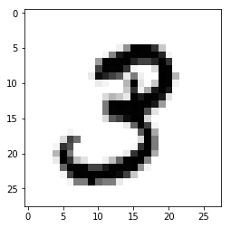
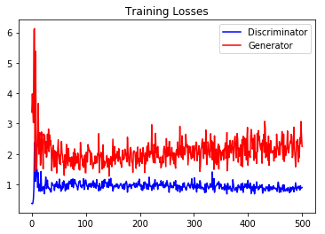
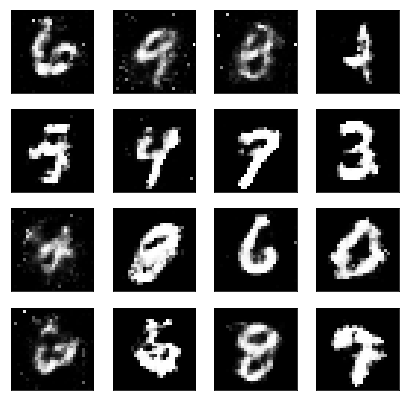

# Generative Adversarial Network

In this blog, we'll be building a **generative adversarial network (GAN)** trained on the MNIST dataset. From this, we'll be able to generate new handwritten digits. GAN's were introduced by **Ian Goodfellow** et al. in 2014. Since then, GANs have exploded in popularity.  This technique can generate photographs that look at least superficially authentic to human observers, having many realistic characteristics.

In Machine Learning, GANs are a class of **artificial intelligence algorithms** used in unsupervised machine learning. 
The idea behind GANs is that you have two networks, a `generator  G`, and a `discriminator  D`, competing with each other in a **zero-sum game framework**. 

The generator makes fake data to pass to the discriminator, technically generative network learns to map from a `latent space` to a particular `data distribution of interest`,  The discriminator also sees real data and predicts if the data it's received is `real` or `fake` by discriminates between instances from the `real data distribution` and `candidates produced by the generator`. 


The **generator is trained to fool the discriminator, and it wants to output data that looks as close as possible to real data**, by producing novel synthesized instances that appear to have come from the real data distribution. Moreover, the discriminator is trained to figure out which data is real and which is fake. What ends up happening is that the **generator learns to make data that is indistinguishable from real data to the discriminator**.

`Backpropagation` is applied in both networks so that the **generator produces better images**, while the **discriminator becomes more skilled at flagging synthetic images**. The generator is typically a deconvolutional neural network, and the discriminator is a convolutional neural network.


## Import Data and Libraries


```python
import tensorflow as tf
import numpy as np
import pickle as pkl
```


```python
import matplotlib.pyplot as plt
%matplotlib notebook
```


```python
from tensorflow.examples.tutorials.mnist import input_data
mnist = input_data.read_data_sets("./data/",one_hot=True)
```

    Extracting ./data/train-images-idx3-ubyte.gz
    Extracting ./data/train-labels-idx1-ubyte.gz
    Extracting ./data/t10k-images-idx3-ubyte.gz
    Extracting ./data/t10k-labels-idx1-ubyte.gz


```python
plt.imshow(mnist.train.images[1].reshape(28,28),cmap='Greys');
```





## Model Inputs

First we need to create the inputs for our tensorflow graph. We need two inputs, one for the **generator** and one for the **discriminator**. Here we'll call the generator input `inputs_z` and the discriminator input `inputs_real`.


```python
# function to create placeholder for input data
def model_inputs(real_dim, z_dim):
    
    # placeholder for real data
    inputs_real = tf.placeholder(tf.float32,shape=[None,real_dim])
    
    # placeholder for latent space
    inputs_z = tf.placeholder(tf.float32,shape=[None,z_dim])
    
    return(inputs_real, inputs_z)
```

## Generator

The input to the generator is a series of randomly generated numbers called `latent sample`. `Latent variables` are variables that are not directly observed but are rather inferred through a **mathematical model** from other variables that are observed.

Generator are neural network with hidden layer and tanh output. Once trained, the generator can produce digit images from latent samples.


```python
# function to create generator
def generator(z, out_dim, n_units=128, reuse=False, alpha=0.01):
    with tf.variable_scope('generator', reuse=reuse):
        
        # Hidden layer
        hidden1 = tf.layers.dense(z, n_units, activation=None)
        
        # Leaky ReLU
        hidden1 = tf.maximum(alpha * hidden1, hidden1)

        # Logits and tanh output
        logits = tf.layers.dense(hidden1, out_dim, activation=None)
        output = tf.tanh(logits)
        
        return(output)
```

## Discriminator

The discriminator is a classifier trained using the supervised learning. It classifies whether an image is `real (1)` or `Fake (0)`. We train the discriminator using both the `dataset` and the images `generated` by the generator. 

If the input image is from the MNIST database, the discriminator should classify it as real. If the input image is from the generator, the discriminator should classify it as fake. The discriminator network is almost exactly the same as the generator network, except that we're using a sigmoid output layer.


```python
def discriminator(x, n_units=128, reuse=False, alpha=0.01):
    with tf.variable_scope('discriminator', reuse=reuse):
        
        # Hidden layer
        hidden1 = tf.layers.dense(x, n_units, activation=None)
        
        # Leaky ReLU
        hidden1 = tf.maximum(alpha * hidden1, hidden1)
        
        # Logits and sigmoid output
        logits = tf.layers.dense(hidden1, 1, activation=None)
        output = tf.sigmoid(logits)
        
        return(output, logits)
```

## Hyperparameters


```python
# Size of input image to discriminator
input_size = 784
# Size of latent vector to generator
z_size = 100

# Sizes of hidden layers in generator and discriminator
g_hidden_size = 128
d_hidden_size = 128

# Leak factor for leaky ReLU and Smoothing 
alpha = 0.01
smooth = 0.1
```

## Define Network

To building the network from the functions defined above we connect the generator and the discriminator to produce a GAN.

* First is to get our inputs, `input_real, input_z` from `model_inputs` using the sizes of the input and z.

* Then, we'll create the generator. This builds the generator with the appropriate input and output sizes.

* Then the discriminators. We'll build two of them, one for real data and one for fake data.

We will set `reuse=True`, since we want the weights to be the same for both real and fake data, we need to reuse the variables.


```python
tf.reset_default_graph()
# Create our input placeholders
input_real, input_z = model_inputs(input_size, z_size)

# Build the generator model
g_model = generator(input_z, input_size, n_units=g_hidden_size, alpha=alpha)

# Build the two discriminator model 'one for real images and one for generator images' and update common weights
d_model_real, d_logits_real = discriminator(input_real, n_units=d_hidden_size, alpha=alpha)
d_model_fake, d_logits_fake = discriminator(g_model, reuse=True, n_units=d_hidden_size, alpha=alpha)
```

## Define Losses

Now we need to calculate the losses, which is a little tricky. For the discriminator, the total loss is the sum of the losses for real and fake images.

``` d_loss = d_loss_real + d_loss_fake ```


For the real image logits, we'll use `d_logits_real` which we got from the discriminator in the cell above. For the labels, we want them to be all ones, since these are all real images. To help the discriminator generalize better, the labels are reduced a bit from 1.0 to 0.9.

The discriminator loss for the fake data is similar. The logits are `d_logits_fake`, which we got from passing the generator output to the discriminator. These fake logits are used with labels of all zeros. Remember that we want the discriminator to output 1 for real images and 0 for fake images, so we need to set up the losses to reflect that.

Finally, the generator losses are using `d_logits_fake`, the fake image logits. But, now the labels are all ones. The generator is trying to fool the discriminator, so it wants to discriminator to output ones for fake images.


```python
def loss_func(logits_in,labels_in):
    return(tf.reduce_mean(tf.nn.sigmoid_cross_entropy_with_logits(logits=logits_in,labels=labels_in)))
```


```python
# discriminator loss for fake and real images
d_loss_real = loss_func(d_logits_real, tf.ones_like(d_logits_real) * (1 - smooth))
d_loss_fake = loss_func(d_logits_fake, tf.zeros_like(d_logits_fake))

# total discriminator loss
d_loss = d_loss_real + d_loss_fake
```


```python
# generator loss
g_loss = loss_func(d_logits_fake, tf.ones_like(d_logits_fake))
```

## Optimizers

We are going to create two optimizer, one for generator and one for discriminator. To update the generator and discriminator variables separately, we need need list of variable specific to the optimizer. To get all the trainable variables, we use `tf.trainable_variables()`. 

We have used variable scope to start all of our generator variable names with `generator`, and all the variables in the discriminator start with `discriminator`. Now, we just need to iterate through the list from `tf.trainable_variables()` and keep variables to start with `generator` in `g_vars` and `discriminator` in `d_vars`. 


```python
# Get all the trainable_variables, and split into G and D parts
t_vars = tf.trainable_variables()
g_vars = [var for var in t_vars if var.name.startswith('generator')]
d_vars = [var for var in t_vars if var.name.startswith('discriminator')]
```


```python
# Learning Rate
learning_rate = 0.002

# Optimizers
d_train_opt = tf.train.AdamOptimizer(learning_rate).minimize(d_loss, var_list=d_vars)
g_train_opt = tf.train.AdamOptimizer(learning_rate).minimize(g_loss, var_list=g_vars)
```

## Network Training


```python
batch_size = 100
epochs = 500
losses = []
```


```python
# Only save generator variables
saver = tf.train.Saver(var_list=g_vars)

# initialize session
with tf.Session() as sess:
    
    # initialize global variable
    sess.run(tf.global_variables_initializer())
    
    for e in range(epochs):
        
        # train the model 
        for i in range(mnist.train.num_examples//batch_size):
            batch = mnist.train.next_batch(batch_size)
            
            # Get images, reshape and rescale to pass to D
            batch_images = batch[0].reshape((batch_size, 784))
            batch_images = batch_images*2 - 1
            
            # Sample random noise for G
            batch_z = np.random.uniform(-1, 1, size=(batch_size, z_size))
            
            # Run optimizers
            _ = sess.run(d_train_opt, feed_dict={input_real: batch_images, input_z: batch_z})
            _ = sess.run(g_train_opt, feed_dict={input_z: batch_z})
        
        # At the end of each epoch, get the losses and print them out
        train_loss_d = sess.run(d_loss, {input_z: batch_z, input_real: batch_images})
        train_loss_g = g_loss.eval({input_z: batch_z})
            
        print("Epoch {}/{} - DLoss: {:.4f} - GLoss: {:.4f} \r".format(e+1,epochs,train_loss_d,train_loss_g),end='')  
        
        # Save losses to view after training
        losses.append((train_loss_d, train_loss_g))
        
        # Save sess checkpoint
        saver.save(sess, './checkpoints/generator.ckpt')
```

    Epoch 500/500 - DLoss: 0.8963 - GLoss: 2.2485 


```python
# Save training losses after each epoch
with open('train_losses.pkl', 'wb') as f:
    pkl.dump(losses, f)
```

## Training Loss Visualization

In training we have created a list of losses for `generator` and `discriminator` to  check how well our GAN is trained. Now we can visualize using `train_losses.pkl`.


```python
# Load samples from generator taken while training
with open('train_losses.pkl', 'rb') as f:
    losses = pkl.load(f)
```


```python
# visualize losses for generator and discriminator
fig, ax = plt.subplots()
losses = np.array(losses)
plt.plot(losses.T[0], label='Discriminator',c='b')
plt.plot(losses.T[1], label='Generator',c='r')
plt.title("Training Losses")
plt.legend();
```





## Generate New Sample


```python
# load the generator variables
saver = tf.train.Saver(var_list=g_vars)

# initialize session
with tf.Session() as sess:
    
    # restor the checkpoints
    saver.restore(sess, tf.train.latest_checkpoint('checkpoints'))
    
    # create random noise for the generator
    sample_z = np.random.uniform(-1, 1, size=(16, z_size))
    
    # generate new sample
    gen_samples = sess.run(generator(input_z, input_size, n_units=g_hidden_size, reuse=True, alpha=alpha),
                           feed_dict={input_z: sample_z})
    
    # plot the result
    fig, axes = plt.subplots(figsize=(7,7), nrows=4, ncols=4, sharey=True, sharex=True)
    for ax, img in zip(axes.flatten(), gen_samples):
        ax.xaxis.set_visible(False)
        ax.yaxis.set_visible(False)
        im = ax.imshow(img.reshape((28,28)), cmap='Greys_r')
```

    INFO:tensorflow:Restoring parameters from checkpoints/generator.ckpt




